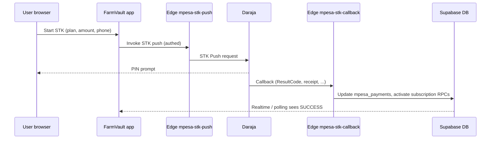
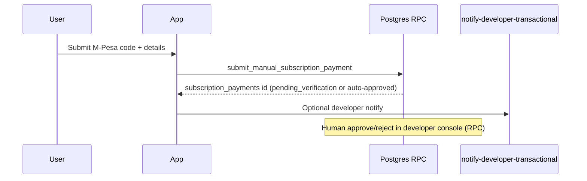

# FarmVault — Full system production audit (comprehensive)

**Document type:** Production readiness / QA stabilization audit  
**Product:** FarmVault (live SaaS — farm management)  
**Date:** 2026-04-12  
**Version:** 2.0 (expanded super-detailed pass)

---

## Document control

| Field | Value |
|--------|--------|
| Primary goal | Confirm the system can handle **real users** without breaking: stability, correctness, security, predictable payments and data. |
| Explicit non-goals | No new features, no UI redesign, no business-logic changes except documented bug fixes. |
| Evidence types used | Static code review; SQL migration review; `npm run build` (passed); cross-reference to internal audits listed below. |
| What this is **not** | A substitute for **staging/production E2E** with live Clerk, Supabase project, Daraja (M-Pesa), and real mobile devices. |

**Related internal audits (read together):**

| Document | Role |
|----------|------|
| `docs/LAUNCH_READINESS_QA_AUDIT_2026-04-12.md` | Short launch-focused QA + **inline code citations** |
| `docs/SYSTEM_AUDIT_2026-04-12.md` | Broader system observations |
| `docs/AUDIT_NOT_IMPLEMENTED.md` | Intended hardening vs implemented |
| `docs/SPRINT_01_PAYMENTS_SECURITY.md` | Payments security matrix + env validation |
| `docs/RESILIENCE_ARCHITECTURE.md` | Emergency access architecture notes |
| `docs/PHASE_0_ENV_CHECKLIST.md` | Env hygiene checklist |

---

## Table of contents

1. [Executive summary](#1-executive-summary)  
2. [Methodology and limits of static audit](#2-methodology-and-limits-of-static-audit)  
3. [System inventory](#3-system-inventory)  
4. [Supabase Edge Functions catalog](#4-supabase-edge-functions-catalog)  
5. [Backend surface: RPCs and schemas (representative)](#5-backend-surface-rpcs-and-schemas-representative)  
6. [Phase 1 — Authentication and onboarding](#6-phase-1--authentication-and-onboarding)  
7. [Phase 2 — Core data flows](#7-phase-2--core-data-flows)  
8. [Phase 3 — Analytics and reporting RPCs](#8-phase-3--analytics-and-reporting-rpcs)  
9. [Phase 4 — Payments (STK + manual fallback)](#9-phase-4--payments-stk--manual-fallback)  
10. [Phase 5 — Subscription logic and plan limits](#10-phase-5--subscription-logic-and-plan-limits)  
11. [Phase 6 — Rate limiting and abuse resistance](#11-phase-6--rate-limiting-and-abuse-resistance)  
12. [Phase 7 — Multi-user behavior](#12-phase-7--multi-user-behavior)  
13. [Phase 8 — Offline and network resilience](#13-phase-8--offline-and-network-resilience)  
14. [Phase 9 — Security and tenancy (RLS + routes)](#14-phase-9--security-and-tenancy-rls--routes)  
15. [Phase 10 — UX validation](#15-phase-10--ux-validation)  
16. [Phase 11 — Performance](#16-phase-11--performance)  
17. [Phase 12 — Production configuration](#17-phase-12--production-configuration)  
18. [Phase 13 — End-to-end smoke journey](#18-phase-13--end-to-end-smoke-journey)  
19. [Consolidated issue register (all severities)](#19-consolidated-issue-register-all-severities)  
20. [Remediation backlog (prioritized)](#20-remediation-backlog-prioritized)  
21. [Staging sign-off template](#21-staging-sign-off-template)  
22. [Launch verdict](#22-launch-verdict)

---

## 1. Executive summary

FarmVault is a **multi-tenant** React application on **Vite**, authenticated primarily via **Clerk**, with **Supabase** (Postgres multi-schema, RLS, RPCs, Realtime) and **Deno Edge Functions** for M-Pesa, onboarding, notifications, and operational tasks. Subscription billing for farmers is implemented on **Supabase** (STK push, callbacks, RPCs, `subscription_payments`, `mpesa_payments`); some **legacy/admin** paths may still reference **Firebase** for payments — this is a **reconciliation and support risk** if both are used without a single system of record.

**Static review conclusion:** The codebase shows **meaningful hardening** (route guards, billing client validation, payment reconciliation concepts, analytics error surfaces on reports, finance DB checks such as `finance.expenses.amount >= 0`). Several **production-critical** items remain: **STK Query exception handling** that can **trust callback alone**, **human-gated manual subscription approval**, **concurrency without optimistic locking** on key entities (e.g. projects), **large JS bundles**, and **deployment coupling** between **soft-delete migrations** and **analytics RPC** definitions. **Cross-tenant duplicate M-Pesa manual codes** are **mitigated in repo** by migration `20260412401000_manual_payment_tx_unique_auto_validate.sql` (must be **applied** in production).

**Launch posture:** Appropriate for a **controlled soft launch** with staffed payment review, strict CI env validation, and a staging smoke matrix. **Full public launch** should wait until Critical items are fixed or formally accepted with compensating operational controls.

---

## 2. Methodology and limits of static audit

### 2.1 What was performed

| Activity | Detail |
|----------|--------|
| Repository structure | `src/` (React), `supabase/migrations/`, `supabase/functions/` |
| Build verification | `npm run build` — **success** (Vite + PWA); warnings: very large main chunk, dynamic import note on `adminAlertService` |
| Pattern review | Auth gates (`RequireOnboarding`, `RequireDeveloper`, `PermissionRoute`), billing (`BillingModal`, `StkPushConfirmation`, `billingSubmissionService`), analytics consumers (`useFarmAnalyticsReports`, `analyticsReportsService`, `ReportsPage`) |
| SQL review | Representative migrations: finance expenses, manual payment uniqueness migration, analytics / soft-delete chain (filenames in Phase 8) |
| Cross-doc alignment | Merged findings with `LAUNCH_READINESS_QA_AUDIT_2026-04-12.md` issue IDs **C1–C6 / H1–H6** where applicable |

### 2.2 What must be executed outside the repo

| Area | Why |
|------|-----|
| Clerk OAuth (e.g. Google) | Provider configuration, redirect URLs, session cookies — dashboard-level |
| Daraja STK in sandbox/production | Safaricom credentials, callback URL reachability, IP allowlists |
| RLS as actually enforced | Requires **authenticated JWT** in Supabase with real `company_id` claims — run SQL as test users |
| Load and rate limits | Synthetic or real traffic on staging |
| Two-browser concurrency | Human QA timing |

### 2.3 Severity definitions (used consistently below)

| Level | Meaning |
|-------|---------|
| **Critical** | Security hole, wrong money/subscription state, cross-tenant data exposure, or production config that invalidates isolation guarantees. |
| **High** | Reliability failure under realistic conditions, silent data loss, or broken primary path without workaround. |
| **Medium** | Degraded UX, operational friction, or integrity issue mitigated by DB constraints or secondary checks. |
| **Low** | Cosmetic, rare edge, or documentation-only follow-ups. |

---

## 3. System inventory

### 3.1 Client application

| Item | Location / notes |
|------|------------------|
| Entry | `src/main.tsx` — Clerk provider, `afterSignInUrl` / `afterSignUpUrl` → `/auth/callback`; emergency-only bootstrap path when no Clerk key but Supabase emergency config |
| Auth bridge | `ClerkAuthBridge` (from `main.tsx`); heavy bootstrap in `src/contexts/AuthContext.tsx` (RPCs: `current_context`, `ensure_current_membership`, `is_developer`, profile resolution) |
| Routing | `src/App.tsx` — nested routes, `PermissionRoute`, `RequireOnboarding`, `RequireDeveloper` |
| State / data | TanStack Query; Supabase client in `src/lib/supabase` (`getAuthedSupabase`, JWT template name used with Clerk) |
| PWA | Service worker build in `npm run build` output; offline queue modules present (see Phase 8) |

### 3.2 Supabase

| Layer | Responsibility |
|-------|----------------|
| Postgres schemas | `core`, `finance`, `harvest`, `projects`, `admin`, `public` RPC façade, etc. (exact set in migrations) |
| RLS | Tenant isolation — **must be validated per table** with two company accounts in staging |
| RPCs | Tenant context, billing, analytics, harvest workflows, developer tooling |
| Realtime | Used for M-Pesa payment row updates in `StkPushConfirmation` |
| Edge Functions | M-Pesa, onboarding, email, push, rate-limit helper, reconcile, etc. (catalog in Section 4) |

---

## 4. Supabase Edge Functions catalog

The following **function directories** exist under `supabase/functions/` (each typically exposes `index.ts`). Purpose is summarized for **QA routing** (exact behavior: read each function’s source before changing).

| Function folder | Primary concern for production QA |
|-----------------|-------------------------------------|
| `mpesa-stk-push` | Initiates STK; auth, amount, company binding |
| `mpesa-stk-callback` | Daraja callback → updates `mpesa_payments`, subscription activation path; **Critical:** STK Query exception handling |
| `mpesa-payment-reconcile` | Backfill / stuck SUCCESS handling — runbook in payment docs |
| `create-company-onboarding` | Company creation from authenticated user (used from `SetupCompany` flow) |
| `create-company` | Legacy/alternate company creation path — confirm which is canonical in ops |
| `notify-company-transactional` | Company-facing transactional email |
| `notify-company-submission-received` | Submission / onboarding emails |
| `notify-company-workspace-ready` | Workspace ready notifications |
| `notify-developer-transactional` | Developer/ops alerts (e.g. manual payment submitted) |
| `notify-developer-company-registered` | New company registration signal |
| `notify-ambassador-onboarding` | Ambassador program |
| `invite-employee` / `resend-employee-invite` / `revoke-employee-invite` | Workforce onboarding; Clerk key type logging |
| `send-farmvault-email` | Generic email send |
| `farmvault-email-test` | **Non-prod** or restricted use — confirm not exposed publicly |
| `billing-receipt-issue` | Receipt issuance |
| `emergency-access` | **Server-gated** emergency access (preferred over client `VITE_EMERGENCY_*`) |
| `rate-limit-check` | Centralized rate limit consult |
| `sync-push-subscription` / `notification-push-dispatch` / `onesignal-notify` / `admin-alert-push-notify` | Push pipeline |
| `engagement-email-cron` | Scheduled engagement |

**QA action:** Maintain a **deployed version matrix** (Supabase dashboard): each function’s **secrets**, **JWT verification** setting, and **CORS** must match the app origins you use in production.

---

## 5. Backend surface: RPCs and schemas (representative)

This is **not exhaustive** of every migration-defined RPC; it lists **high-traffic surfaces** seen from `src/` grep patterns. DB reviewers should export `pg_proc` from staging for a canonical list.

### 5.1 Tenant / session / profile

| RPC (examples) | Used from |
|----------------|-----------|
| `current_context`, `current_company_id` | `AuthContext`, dev diagnostics, `tenant.ts` |
| `ensure_current_membership`, `company_exists` | `AuthContext` bootstrap |
| `is_developer`, `bootstrap_developer` | `AuthContext` |
| `resolve_or_ensure_platform_profile` | `resolveOrCreatePlatformUser.ts` |
| `get_reset_user_state`, `consume_reset_user_for_signup` | `StartFreshPage`, `AuthContext` |
| `get_user_plan` | `rateLimitHandler.ts` |

### 5.2 Billing and developer approval

| RPC | Used from |
|-----|-----------|
| `submit_manual_subscription_payment` | `billingSubmissionService.ts` |
| `approve_subscription_payment`, `reject_subscription_payment`, `list_pending_payments`, `list_payments_v2`, `set_company_paid_access` | `developerService.ts` |
| `subscription_analytics`, `get_subscription_analytics` | Subscription analytics pages/services |

### 5.3 Farm analytics (reports UI)

| RPC | Service |
|-----|---------|
| `analytics_crop_profit`, `analytics_crop_yield`, `analytics_monthly_revenue`, `analytics_expense_breakdown`, `analytics_report_detail_rows` | `analyticsReportsService.ts` |

### 5.4 Harvest (schema-qualified calls)

| RPC | Notes |
|-----|--------|
| `harvest.preview_next_collection_sequence`, `harvest.create_collection`, `harvest.record_intake`, `harvest.close_collection`, `harvest.transfer_collection_to_project` | `harvestCollectionsService.ts` — verify RLS and plan limits in staging |

### 5.5 Inventory

| RPC | Notes |
|-----|--------|
| `record_inventory_stock_in` (via `db.public().rpc`) | `inventoryReadModelService.ts` |

### 5.6 Records / notebook (public RPC façade)

| RPC family | `recordsService.ts` — crop records, attachments, intelligence |

**Static risk:** Any RPC rename or signature drift between **migrations** and **client** causes **500 / PostgREST errors**. CI should run **typegen** or contract tests if introduced later.

---

## 6. Phase 1 — Authentication and onboarding

### 6.1 Scope

Signup (email + OAuth), login persistence, logout, session recovery after refresh; company creation; trial start; mid-flow failure; **onboarding cannot be bypassed** for normal tenant users.

### 6.2 Code and routing touchpoints

| Concern | Location |
|---------|----------|
| Post-sign-in URL | `src/main.tsx` — `getAppEntryUrl("/auth/callback")` |
| Onboarding gate | `src/components/auth/RequireOnboarding.tsx` — `setupIncomplete` → `COMPANY_ONBOARDING_PATH`; developers → `/developer`; ambassador profiles → ambassador console |
| Subscription gate after onboarding | `SubscriptionAccessGate` inside `RequireOnboarding` when not in setup incomplete path |
| Company setup UI | `src/pages/SetupCompany.tsx` — invokes `create-company-onboarding` with Clerk `Authorization` header |
| Deep auth bootstrap | `src/contexts/AuthContext.tsx` — profile fetch, RPC retries, `employeeProfile` shortcut for invited users |

### 6.3 Static findings

| ID | Severity | Finding |
|----|----------|---------|
| P1-A1 | Medium | Onboarding and auth paths are **complex** (many branches: developer, ambassador, reset, employee). **Regression risk** on any refactor — protect with E2E tests on staging. |
| P1-A2 | Low | `SetupCompany` uses origin logic for email links (`localhost` vs production) — verify **emails** point to correct environment in staging. |

### 6.4 Staging test matrix (execute manually)

| # | Test | Pass criteria |
|---|------|----------------|
| T1.1 | Email/password signup | User lands on callback then expected onboarding or dashboard |
| T1.2 | Google OAuth | Same; no redirect loop |
| T1.3 | Refresh while logged in | Session restored; no infinite loading |
| T1.4 | Logout | Clears app state; cannot read tenant data without signing in again |
| T1.5 | Complete company onboarding | Company row exists; trial fields coherent; employee cannot skip admin wizard if company incomplete (per product rules) |
| T1.6 | Abort onboarding mid-step (close tab) | Re-login resumes or shows clear recovery; no orphan user without linkage (inspect `profiles` / memberships) |

---

## 7. Phase 2 — Core data flows

### 7.1 Projects

| Topic | Static notes |
|-------|----------------|
| CRUD | `src/services/projectsService.ts`; soft delete filters `.is('deleted_at', null)` on updates |
| Plan limits | Enforced via hooks/RPCs — **must be verified** against `basic` vs `pro` in staging |
| Delete / orphans | `finance.expenses` FK: `project_id` **null on delete** (see migration `20260305000030_projects_harvest_finance.sql`) — expenses may remain without project; confirm product expectation |
| Concurrency | **Critical** gap: `updateProject` does not use `row_version` — **C-DATA-1** |

### 7.2 Expenses

| Topic | Static notes |
|-------|----------------|
| Create path | `ExpensesPage.tsx` → `createFinanceExpense` in `financeExpenseService.ts` |
| DB integrity | `amount numeric not null check (amount >= 0)` on `finance.expenses` |
| Client validation | **Medium:** amount parsed with `Number(amount \|\| '0')` — negative blocked by DB but **UX** is generic failure (**M-EXP-1**) |
| Rapid inserts | Staging load test; watch for rate limits and UI double-submit |

### 7.3 Harvest

| Topic | Static notes |
|-------|----------------|
| Collections / intake | `harvestCollectionsService.ts` — multiple RPCs; picker limits (e.g. 50) must be verified in **SQL/RPC** and UI |
| Duplicates / orphans | Staging: duplicate picker, move collection between projects |

### 7.4 Inventory

| Topic | Static notes |
|-------|----------------|
| Stock movements | RPC `record_inventory_stock_in`; negative stock policy — confirm **business rules** in DB triggers or app validation |

### 7.5 Employees

| Topic | Static notes |
|-------|----------------|
| Invite | Edge `invite-employee`, `resend-employee-invite` |
| Permissions | `src/lib/access/rolePresetDefaults.ts` + stored per-employee overrides |
| Suspended users | Confirm **AuthContext** and RLS both block |

### 7.6 Staging test matrix (sample)

| # | Area | Action | Expected |
|---|------|--------|----------|
| T2.1 | Projects | Create at plan limit | Blocked with clear upgrade / limit message |
| T2.2 | Projects | Delete project with expenses | No crash; expenses behavior matches spec |
| T2.3 | Expenses | Add valid expense | Row in `finance.expenses` |
| T2.4 | Expenses | Negative amount | DB or client rejection; **human-readable** message after M-EXP-1 fix |
| T2.5 | Harvest | Full harvest + pickers + weights | Totals consistent; limits enforced |
| T2.6 | Employees | Invite → accept | Role permissions as configured |

---

## 8. Phase 3 — Analytics and reporting RPCs

### 8.1 Critical RPCs (user-facing reports)

| RPC | Client entry |
|-----|----------------|
| `analytics_crop_yield` | `fetchAnalyticsCropYield` |
| `analytics_monthly_revenue` | `fetchAnalyticsMonthlyRevenue` |
| `analytics_crop_profit` | `fetchAnalyticsCropProfit` |
| `analytics_expense_breakdown` | `fetchAnalyticsExpenseBreakdown` |
| `analytics_report_detail_rows` | PDF / detail export |

### 8.2 Migration chain (soft delete and column compatibility)

Analytics functions are **redefined** across multiple migrations. Deploy **in timestamp order**. Particularly relevant files (non-exhaustive):

| Migration file (examples) | Concern |
|---------------------------|---------|
| `20260402141000_reports_analytics_rpc.sql` | Base RPC definitions |
| `20260402146000_analytics_rpc_disable_rls.sql` | Security definer / execute grants pattern |
| `20260412180000_analytics_rpc_respect_soft_delete.sql` | Soft-delete awareness |
| `20260412310000_sprint2_analytics_harvests_soft_delete.sql` | Harvest-related analytics |
| `20260412340000_analytics_rpc_conditional_deleted_at.sql` | Conditional `deleted_at` handling |
| `20260412350000_soft_delete_standardize_core_entities.sql` | Core entity standardization + analytics copies |

**Risk H-MIG-1:** If the app expects `deleted_at` filters but DB is behind, **list screens and RPC totals disagree** or RPCs error on missing columns.

### 8.3 UI resilience

| Item | Assessment |
|------|------------|
| RPC throws | `analyticsReportsService.ts` **throws** on error; `useFarmAnalyticsReports` surfaces `isError` |
| `ReportsPage` | Renders error UI when `analytics.isError` — **good** anti-crash pattern |

### 8.4 Staging tests

| # | Test | Pass criteria |
|---|------|----------------|
| T3.1 | Soft-delete a harvest/expense/project | Reports exclude archived data per policy; no SQL error |
| T3.2 | Large dataset | Response time acceptable; consider `EXPLAIN ANALYZE` on staging |

---

## 9. Phase 4 — Payments (STK + manual fallback)

### 9.1 Intended flows (logical)

Manual path (simplified):

### 9.2 Static findings (detailed)

| ID | Topic | Detail |
|----|-------|--------|
| **C-STK-1** | STK Query + callback | When `shouldVerifyStkSuccessWithQuery()` is true and **STK Query throws**, code logs `stk_query_error_trust_callback` and **does not** set `allowActivation = false` for that failure mode — activation can proceed on callback alone. See `supabase/functions/mpesa-stk-callback/index.ts`. |
| **C-OPS-1** | Manual path | Human approval required for typical manual verification — **latency and ops load** at scale. |
| **M-MANUAL-1** | Duplicate codes | Migration `20260412401000_manual_payment_tx_unique_auto_validate.sql` introduces **normalized** unique index on active manual rows — addresses cross-tenant duplicate claims **after deploy**. Supersedes older audit note C3 **once applied**. |
| **H-AUTH-1** | Client consistency | `StkPushConfirmation.tsx` uses **default** `supabase` client for `mpesa_payments` and Realtime; `BillingModal.tsx` uses `getAuthedSupabase` + Clerk JWT template — **JWT lag** edge case. |
| Double-click | Client | `BillingModal` uses mutation pending / busy patterns (see `LAUNCH_READINESS` payment table) |
| Slow network | Client | `StkPushConfirmation` retry + Realtime subscription |

### 9.3 Staging test matrix (payments)

| # | Scenario | Steps | Expected |
|---|----------|-------|----------|
| T4.1 | Happy STK | Pay with test shortcode | `mpesa_payments` SUCCESS; subscription active; UI closes / gate clears |
| T4.2 | Double-click pay | Rapid two clicks | Single checkout or idempotent handling; no double charge to customer if Daraja rejects duplicate |
| T4.3 | User cancel on phone | Decline PIN | FAILED path; clear UI; no subscription activation |
| T4.4 | Airplane mode | Toggle mid-flight | Retry messaging; recovery on reconnect; no duplicate subscription without reconcile rules |
| T4.5 | Manual submit | Valid code | `pending_verification` or auto-validate if matches STK row (per migration logic) |
| T4.6 | Duplicate code | Same code to two companies (post unique index) | Second rejected with readable error |
| T4.7 | STK Query forced failure | Simulate Daraja error in sandbox | Observe whether activation is deferred (**desired**) vs trusted-callback (**document risk**) |

---

## 10. Phase 5 — Subscription logic and plan limits

### 10.1 Touchpoints

| Area | Location / table |
|------|------------------|
| Company subscription row | `company_subscriptions` (queried via `billingSubmissionService`, gates) |
| Trial | `companyService.createCompany` seeds trial-like subscription JSON (legacy path); **canonical** source may be RPC/edge onboarding — reconcile in ops doc |
| UI gates | `SubscriptionAccessGate`, `useSubscriptionStatus`, feature access hooks |

### 10.2 Staging tests

| # | Test | Expected |
|---|------|----------|
| T5.1 | Trial expiry | App blocks or prompts pay; no crash |
| T5.2 | Limits (projects, employees, pickers) | Hard stop at plan; message clear |
| T5.3 | Upgrade / downgrade | Billing state consistent; no stale gate |

---

## 11. Phase 6 — Rate limiting and abuse resistance

| Item | Notes |
|------|--------|
| Edge `rate-limit-check` | Exists — map which user actions invoke it |
| RPC limits | System audit references — confirm per-RPC in DB |
| Client | Buttons should disable while pending — spot-check critical forms |

**Staging:** scripted rapid inserts (expenses, harvest lines) with monitoring for **429** / RPC errors / DB CPU.

---

## 12. Phase 7 — Multi-user behavior

| Concern | Static conclusion |
|---------|---------------------|
| Same record, two editors | **No merge** — last write wins for at least **projects** (**C-DATA-1**) |
| Realtime updates | Some modules may not subscribe — user may see stale data until refetch |

**Staging:** two browsers, same project, edit name simultaneously — document outcome for support FAQ.

---

## 13. Phase 8 — Offline and network resilience

| Item | Notes |
|------|--------|
| PWA | Built in production pipeline |
| Offline queue | `offlineQueueSync` and related modules — **H-OFF-1**: financial correctness of replay **not proven** in static review |
| User feedback | Prefer explicit “queued / failed / will retry” copy on write failures |

---

## 14. Phase 9 — Security and tenancy (RLS + routes)

### 14.1 Route guards (app layer)

| Route pattern | Guard |
|---------------|--------|
| Main app shell | `RequireOnboarding` |
| `/developer/*` | `RequireDeveloper` |
| `/billing` | `PermissionRoute module="settings"` — **staff with `settings.view`** see billing UI |
| Per-module pages | `PermissionRoute` with module key |

**Preset note:** Only **`administrator`** preset includes `settings.view: true` in `rolePresetDefaults.ts`; other presets use `minimal()` for settings. **Custom** permission JSON can still grant `settings.view` — **RLS must block** sensitive billing reads/writes for unauthorized employees (**H-SEC-1**).

### 14.2 RLS verification methodology (staging)

For each sensitive table (`subscription_payments`, `mpesa_payments`, `finance.expenses`, `harvest.*`, etc.):

1. Create **User A** and **User B** in different companies.  
2. As **User B**, attempt `select` / `update` with known IDs from company A (via SQL editor with user JWT or via API).  
3. **Expect:** zero rows or policy error.

---

## 15. Phase 10 — UX validation

| Heuristic | Examples in codebase |
|-----------|----------------------|
| Loading states | `AuthLoadingScreen`, billing toasts, report analytics loading |
| Errors | `ReportsPage` analytics block; billing `normalizeRpcErrorMessage` |
| Dead clicks | Audit buttons during `isPending` on critical modals |
| Manual pay clarity | Pending verification banner (product polish — **L-UX-1**) |

---

## 16. Phase 11 — Performance

| Finding | Severity | Evidence |
|---------|----------|----------|
| Main bundle ~5 MB gzip ~1.3 MB (order of magnitude from build log) | **High** for rural 3G | `npm run build` output |
| Dynamic import warning | **Low** | `adminAlertService` static + dynamic import |
| Analytics | Soft-delete adds predicates — validate indexes on staging with `EXPLAIN` |

---

## 17. Phase 12 — Production configuration

### 17.1 Automated checks

| Script | Command |
|--------|---------|
| Public env validation | `npm run validate:env` |
| Strict (CI) | `npm run validate:env:strict` |

### 17.2 Configuration checklist

| Check | Failure mode |
|-------|----------------|
| `VITE_CLERK_PUBLISHABLE_KEY` is `pk_live_*` in production | Wrong Clerk instance / dev limits (**C-PROD-1**) |
| No `VITE_EMERGENCY_*` in prod bundle | Client-visible bypass (**C-PROD-1**) |
| `VITE_ENABLE_DEV_GATEWAY=false` | Accidental dev proxy to prod data |
| `VITE_ENABLE_MPESA_STK` | Document intentional disable for maintenance |
| Clerk allowed redirect URLs | Include production origin `/auth/callback` |
| Supabase Edge secrets | Daraja keys, service role, Resend, etc. |

### 17.3 Client guards

| File | Role |
|------|------|
| `src/lib/clerkProductionGuard.ts` | Warns on `pk_test_*` on non-localhost |

---

## 18. Phase 13 — End-to-end smoke journey

Execute on **staging** in order; record pass/fail and screenshots for failures.

| Step | Journey | Validation |
|------|-----------|------------|
| 1 | Signup | Account created; email verified if required |
| 2 | Onboarding | Company + trial; no broken middle state |
| 3 | Create project | Appears in list; limits respected |
| 4 | Add expenses | Totals and dashboards update |
| 5 | Harvest | Collections + pickers + weights |
| 6 | Reports | RPCs succeed; charts match expectations |
| 7 | Invite employee | Accept invite; permissions enforced |
| 8 | Pay subscription | STK primary path; subscription becomes active |
| 9 | Regression | Logout / login; data still correct |

---

## 19. Consolidated issue register (all severities)

### 19.1 Critical

| This doc ID | Summary | Maps to `LAUNCH_READINESS` |
|-------------|---------|----------------------------|
| **C-STK-1** | STK Query exception → trust callback activation | C2 |
| **C-OPS-1** | Manual verification human bottleneck | C1 |
| **C-PROD-1** | Prod keys / emergency client vars / dev gateway | C4 |
| **C-DATA-1** | Concurrent project updates without row_version | C5 |
| **C-LEDGER-1** | Supabase vs Firebase payment confusion | C6 |

### 19.2 High

| ID | Summary | Maps to |
|----|---------|---------|
| **H-AUTH-1** | `StkPushConfirmation` supabase client vs authed client | H1 |
| **H-SEC-1** | Billing behind `settings` permission | H2 |
| **H-OFF-1** | Offline replay not proven | H4 |
| **H-MIG-1** | Migration / app deploy ordering | H5 |
| **H-PERF-1** | Large JS bundle | Performance section |

### 19.3 Medium

| ID | Summary | Maps to |
|----|---------|---------|
| **M-MANUAL-1** | Global tx uniqueness — **mitigated** by `20260412401000_*` when deployed | C3 (historical) |
| **M-EXP-1** | Expense amount UX vs DB constraint | Minor in launch doc |
| **M-LOG-1** | PII in logs | H3 |

### 19.4 Low

| ID | Summary | Maps to |
|----|---------|---------|
| **L-UX-1** | Manual pending visibility | UX improvements |
| **L-ROUTE-1** | Admin on `/staff/*` | M4 |

---

## 20. Remediation backlog (prioritized)

| Priority | Item | Owner suggestion |
|----------|------|-------------------|
| P0 | Patch or accept **C-STK-1** with written risk statement | Backend + security |
| P0 | Run **`validate:env:strict`** in CI/CD gate | DevOps |
| P0 | Apply **`20260412401000`** (and full soft-delete chain) to prod with runbook | DBA |
| P1 | Align **H-AUTH-1** (`StkPushConfirmation` authed client) | Frontend |
| P1 | Document **C-LEDGER-1** system of record + support scripts | Ops |
| P2 | **C-DATA-1** optimistic concurrency for projects (and other hot entities) | Full-stack |
| P2 | **H-PERF-1** code splitting / route-based lazy loading | Frontend |
| P3 | **M-EXP-1** client-side amount validation | Frontend |

---

## 21. Staging sign-off template

| Gate | Owner | Date | Pass / Fail | Notes |
|------|-------|------|-------------|-------|
| Env strict validation | | | | |
| Clerk production instance | | | | |
| STK sandbox E2E | | | | |
| Manual payment + approve | | | | |
| Cross-tenant RLS spot checks | | | | |
| Analytics after soft deletes | | | | |
| Two-user concurrency (documented) | | | | |
| Performance spot (3G throttle) | | | | |

---

## 22. Launch verdict

| Launch type | Condition | Verdict |
|-------------|-----------|---------|
| **Soft launch** | Limited tenants; STK-first; staffed manual review; migrations applied; monitoring on payment tables; **C-STK-1** patched **or** explicitly accepted | **Proceed** with documented risks |
| **Full launch** | Open marketing; expectation of immediate paid access at scale | **Hold** until Critical items remediated or formally accepted with compensating controls |

---

## Revision history

| Version | Date | Change |
|---------|------|--------|
| 1.0 | 2026-04-12 | Initial condensed audit file |
| 2.0 | 2026-04-12 | Expanded comprehensive super-detailed pass (this document) |

---

*End of document.*
