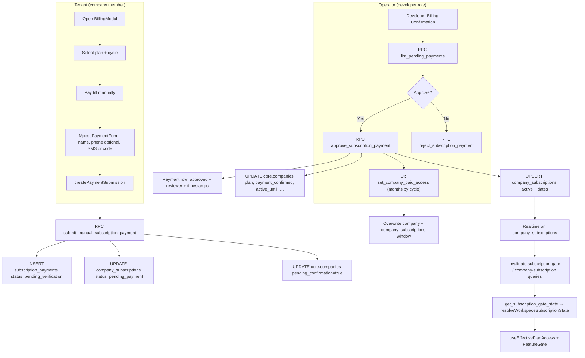

# Manual M-Pesa billing — end-to-end audit

**Purpose:** Document the existing manual billing pipeline before migrating to automated M-Pesa STK.  
**Date:** 2026-04-03  
**Scope:** Codebase as of this audit (Supabase-first; Firebase admin path stubbed).

---

## Executive summary

The **canonical** manual flow is **Supabase**: tenants submit via `submit_manual_subscription_payment`, developers approve via `approve_subscription_payment` (and the Developer Billing UI also calls `set_company_paid_access`). The **`/admin/billing` Firestore-based UI is not viable** for writes because Firestore is stubbed and throws on mutations.

---

## Full manual billing flow (canonical — Supabase)

### Legacy / broken path

- **`/admin/billing`**, `AdminPendingPaymentsPage`, `subscriptionPaymentService` use **Firestore**.
- `src/lib/firestore-stub.ts` throws on writes: **approvals from that UI will fail** until migrated to Supabase.

---

## 1. Manual payment submission flow

| Item | Finding |
|------|--------|
| **Form** | `BillingModal` → `MpesaPaymentForm` (name, phone optional, transaction / pasted SMS). |
| **Service** | `src/services/billingSubmissionService.ts` — `createPaymentSubmission` → RPC `submit_manual_subscription_payment`. |
| **Fields stored** | `plan_id`, `billing_cycle`, `amount`, `mpesa_name`, `mpesa_phone` (optional), `transaction_code`, `currency`, `payment_method` (`mpesa_manual`), optional `notes` (RPC accepts; modal does not collect notes). |
| **Screenshot** | **Not implemented** on `subscription_payments`. |
| **`company_id`** | From `core.current_company_id()` in RPC; stored as **text** on `subscription_payments.company_id`. |
| **User mapping** | **No `user_id` on payment row.** Auth: JWT `core.current_user_id()` must be in `core.company_members` for that company. |
| **Pending status** | Insert uses **`pending_verification`** (not only `pending`). |

**Rate limit:** Another `pending_verification` row for the same company within **30 minutes** blocks submit (RPC).

**Key files**

- `src/components/subscription/billing/BillingModal.tsx`
- `src/services/billingSubmissionService.ts`
- `supabase/migrations/20260403180000_manual_mpesa_phone_optional.sql` (current submit RPC shape)

---

## 2. Pending approval queue

| Item | Finding |
|------|--------|
| **Table** | `public.subscription_payments` |
| **Statuses** | Enum: `pending`, `pending_verification`, `approved`, `rejected`. Manual submit → **`pending_verification`**. |
| **Listing** | `list_pending_payments` / `admin.list_pending_payments` — both **`pending`** and **`pending_verification`**. |
| **Access** | **`admin.is_developer()`** — platform developers, not company admins. |
| **Filtering** | `list_payments_v2` for richer filters (status treats “pending” as both pending variants). |

**Note:** `billing_confirmations` appears only in optional/legacy analytics migrations — **not** the primary manual pipeline.

**Key files**

- `supabase/migrations/20260322190000_developer_subscription_payments_visibility.sql`
- `supabase/migrations/20260331180000_payments_lifecycle_and_ordering_fix.sql` (`list_payments_v2`)

---

## 3. Admin approval logic

| Item | Finding |
|------|--------|
| **Approve RPC** | `public.approve_subscription_payment(_payment_id uuid)` — `SECURITY DEFINER`, **`admin.is_developer()`** only. |
| **Payment row** | Sets approved lifecycle fields; update only if status ∈ (`pending`, `pending_verification`) → **guards double approval**. |
| **Subscription** | Upsert `public.company_subscriptions` (`ON CONFLICT (company_id)`), `status = 'active'`, `billing_mode = 'manual'`. |
| **`core.companies`** | `plan`, `payment_confirmed = true`, `pending_confirmation = false`, `active_until`, `trial_ends_at` cleared. |
| **Reject RPC** | `reject_subscription_payment` — does **not** clear `pending_confirmation` or revert `company_subscriptions` from `pending_payment` (gap). |

**Two-step activation (Developer UI):** `DeveloperBillingConfirmationPage` calls `approve_subscription_payment` **then** `set_company_paid_access` with **1 / 3 / 12 months** from `billing_cycle`. The **effective** window is dominated by **`set_company_paid_access`** when that path runs.

**Key files**

- `supabase/migrations/20260331180000_payments_lifecycle_and_ordering_fix.sql`
- `src/services/developerService.ts` — `approveSubscriptionPayment`, `setCompanyPaidAccess`
- `src/pages/developer/DeveloperBillingConfirmationPage.tsx`

---

## 4. Company subscription activation

| Source | Behavior |
|--------|----------|
| **`approve_subscription_payment`** (latest audited migration) | Sets period end to **`now + 30 days`** (comment: independent of `billing_cycle` on row). |
| **`set_company_paid_access`** | Sets **`active_until = now + N months`** (N capped 1–12), upserts `company_subscriptions`; **`billing_cycle` hardcoded to `monthly`** in SQL. |

**Implication:** If only the approve RPC ran (no second call), tenants would get **30 days**; Developer Console approval gives **calendar months** but may **lose** seasonal/annual on the subscription row’s `billing_cycle`.

---

## 5. Feature gating

| Layer | Role |
|-------|------|
| **`get_subscription_gate_state`** | RPC: `core.companies` + `public.company_subscriptions`. |
| **`resolveWorkspaceSubscriptionState`** | Maps gate → trial / active / `pending_payment`, etc. |
| **`useEffectivePlanAccess`** | Developers + subscription overrides → full access; else subscription-derived plan. |
| **`FeatureGate` / `useFeatureAccess`** | Pro vs Basic from effective plan. |

**Bypass / product behavior**

- **`SubscriptionAccessGate`** allows **`pending_payment`** and **`pending_approval`** as full workspace entry; Pro locking is from plan/trial/paid resolution.
- **Developers** always bypass `FeatureGate`.

**Key files**

- `src/services/subscriptionService.ts`
- `src/lib/resolveWorkspaceSubscriptionState.ts`
- `src/hooks/useSubscriptionStatus.ts`, `useEffectivePlanAccess.ts`, `useFeatureAccess.ts`
- `src/components/subscription/FeatureGate.tsx`, `SubscriptionAccessGate.tsx`

---

## 6. Database schema (manual billing)

### Primary tables

| Table | Purpose |
|-------|---------|
| **`public.subscription_payments`** | Payment attempts; `company_id` **text**; M-Pesa fields; `status` enum; `approved_by`, `approved_at`, `reviewed_*`, `rejected_*`; **no `screenshot_url`**. |
| **`public.company_subscriptions`** | One row per company; plan, status, billing, trial, `active_until`, `current_period_end`. |
| **`core.companies`** | Canonical `plan`, `payment_confirmed`, `pending_confirmation`, `trial_ends_at`, `active_until`. |

### Checklist vs schema

| Field | Location |
|-------|----------|
| `company_id` | `subscription_payments` (text), `company_subscriptions`, `core.companies` |
| `amount` | `subscription_payments.amount` |
| Phone | `mpesa_phone` |
| Message / code | `transaction_code`; optional `notes` |
| Screenshot | **Not present** |
| `status` | `subscription_payments.status` |
| `approved_by` / `approved_at` | `subscription_payments`; subscription row has approval fields on upsert paths |

### Not primary for this flow

- **`manual_payments`** — not used as the main pipeline in this codebase.
- **`billing_confirmations`** — optional/legacy references in some migrations.

---

## 7. Security audit

| Check | Result |
|-------|--------|
| Approve/reject | **`admin.is_developer()`** only (RPC). |
| Self-activation | Tenants cannot approve; submit requires company membership. |
| Duplicate approval | SQL conditional update on pending statuses. |
| Multiple active subscription rows | Single row per company (`ON CONFLICT (company_id)`). |
| RLS | Members read own company payments; developers update; submit via **definer RPC**. |

**Gaps**

- No **unique** constraint on `transaction_code` (duplicate receipt risk).
- **Reject** does not reset workspace pending flags (see §3).

---

## 8. Expiry logic

| Aspect | Finding |
|--------|--------|
| **Duration after approval (Developer UI)** | **1 / 3 / 12 months** via `set_company_paid_access`. |
| **Approve RPC alone** | **30 days** in `20260331180000_payments_lifecycle_and_ordering_fix.sql`. |
| **Server-side cron** | No audited migration that flips subscription `status` when `active_until` passes. |
| **Client** | `getEffectivePlanAccessFromSubscription` uses **`paidUntil` vs now** → Pro features drop when period ends even if DB `status` still says `active`. |
| **Gate RPC** | Returns DB `s.status`; may **lag** real expiry if status is not updated server-side. |

---

## 9. Dashboard reflection

| Mechanism | Finding |
|-----------|--------|
| **Fetch** | `useSubscriptionStatus` → `get_subscription_gate_state` (React Query). |
| **After approval** | `useCompanySubscriptionRealtime` on `company_subscriptions` invalidates `subscription-gate`, `company-subscription`, etc. |
| **After manual submit** | `BillingModal` invalidates related keys on success. |
| **Caching** | ~30s `staleTime`; realtime reduces perceived delay for subscription row changes. |

---

## 10. Migration readiness (STK automation)

### Keep / reuse

- **`public.company_subscriptions`** + **`core.companies`** as activation targets.
- **`get_subscription_gate_state`**, **`resolveWorkspaceSubscriptionState`**, **`useEffectivePlanAccess`**, **`FeatureGate`**.
- Single-company upsert pattern; **`expected_subscription_amount_kes`** for amount validation.
- **`public.mpesa_payments`** + realtime for STK UI (`20260403201000_mpesa_payments.sql`).

### Replace

- Human approval with **callback-verified success** invoking **one canonical activation RPC**.
- Split between **30-day approve** and **month-based `set_company_paid_access`** — unify duration logic.

### Remove / retire

- Firestore **`AdminBillingPage`** approval path (writes throw) or rewire to Supabase.
- Redundant **`setCompanyPaidAccess` after approve** once a single SQL function encodes cycle → `active_until`.

---

## 11. STK automation migration plan (recommended)

1. **On STK success** (edge function / callback with service role): one **`SECURITY DEFINER`** RPC, e.g. `activate_subscription_from_mpesa_stk(...)`, that:
   - Verifies amount/plan/company from `mpesa_payments` + checkout metadata.
   - Upserts `company_subscriptions` and updates `core.companies` (same fields as manual approval).
   - Records payment in `subscription_payments` or links **`mpesa_payments`** as source of truth with clear FK/reference.
2. **Idempotency:** key on `checkout_request_id` / `MpesaReceiptNumber` to prevent double activation.
3. **Unify duration:** one place for monthly / seasonal / annual → `active_until` (and persist real `billing_cycle`).
4. **Manual queue:** keep for exceptions; define supersede/cancel rules for orphan `pending_verification` rows.
5. **Reject / cleanup:** clear `pending_confirmation` and subscription `pending_payment` when rejecting manual payments.
6. **Optional:** scheduled job to set expired `status` when `active_until < now()` so DB and client align.

---

## Issues found (summary)

1. **`/admin/billing` Firestore path broken** for approvals (writes throw).
2. **Two activation steps** in Developer UI — easy to desync if one path is omitted elsewhere.
3. **`approve_subscription_payment` (30 days)** vs **`set_company_paid_access` (months)** — conflicting single-source-of-truth.
4. **`set_company_paid_access` forces `billing_cycle = 'monthly'`** on upsert.
5. **Reject** does not clean **`pending_confirmation`** / **`pending_payment`**.
6. **No screenshot**; **no submitter user id** on payment row.
7. **No uniqueness** on transaction/receipt codes.
8. **Expiry:** client degrades Pro by date; **DB `status` may stay `active`**.

---

## Risks during migration

- Double activation if both manual approval and STK succeed for the same intent.
- Amount/plan mismatch vs STK request metadata.
- Orphan manual rows when users move to STK-only.
- Realtime: ensure **`company_subscriptions`** still updates so existing query invalidation remains valid.

---

## Production readiness assessment

| Area | Assessment |
|------|------------|
| Tenant submit | **Ready** — RPC validation, membership, amount check, rate limit. |
| Operator queue | **Ready** on Developer console + Supabase RPCs. |
| Activation | **Works** but **logic should be unified** before STK. |
| Legacy admin | **Not safe** until migrated off Firestore stub. |
| Audit trail | **Gaps** — no screenshot, no submitted-by user, weak receipt deduplication. |

---

## Key file index

| Area | Files |
|------|--------|
| Tenant UI | `src/components/subscription/billing/BillingModal.tsx`, `MpesaPaymentForm.tsx` |
| Submit API | `src/services/billingSubmissionService.ts` |
| Developer UI | `src/pages/developer/DeveloperBillingConfirmationPage.tsx` |
| Developer API | `src/services/developerService.ts` |
| Gate / access | `src/services/subscriptionService.ts`, `src/lib/resolveWorkspaceSubscriptionState.ts`, `src/hooks/useSubscriptionStatus.ts`, `useEffectivePlanAccess.ts`, `useFeatureAccess.ts` |
| Realtime | `src/hooks/useCompanySubscriptionRealtime.ts` |
| SQL | `supabase/migrations/20260322120000_manual_mpesa_payment_submissions.sql`, `20260322190000_*.sql`, `20260331180000_payments_lifecycle_and_ordering_fix.sql`, `20260402131500_company_pending_confirmation_and_paid_access_rpc.sql`, `20260403180000_manual_mpesa_phone_optional.sql` |
| STK tracking | `supabase/migrations/20260403201000_mpesa_payments.sql`, `src/services/mpesaStkService.ts` |
| Legacy (broken writes) | `src/lib/firestore-stub.ts`, `src/pages/admin/AdminBillingPage.tsx`, `src/services/subscriptionPaymentService.ts` |
